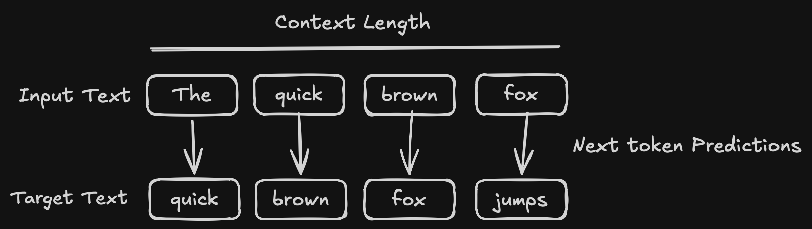
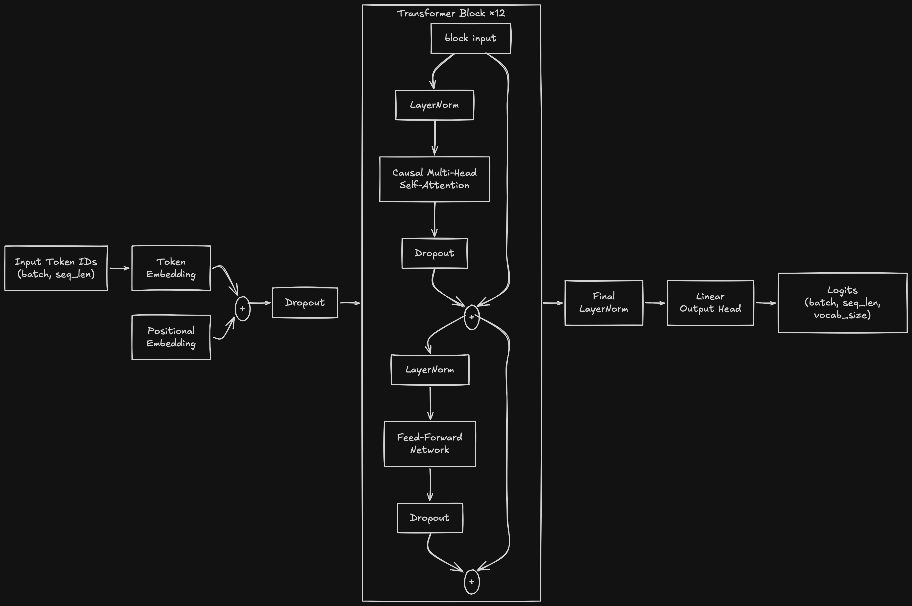

```{python}
#| echo: false
#| output: false
#| eval: true
from pathlib import Path
import json
import itertools
import time

import jax
import optax
import jax.numpy as jnp
import numpy as np

from flax import nnx
import orbax.checkpoint as orbax

from dataclasses import dataclass
import grain.python as pygrain
import polars as pl
import pyarrow as pa

from tqdm.auto import tqdm

import tiktoken
import matplotlib.pyplot as plt

```

# Overview

This is the first post in a three-part series on building a large language model from scratch. Training a modern, instruction-following LLM happens in three stages:

1. <b>Pretraining</b>: Teaching the model to predict the next token over a large corpus of raw text.
2. <b>Instruction tuning</b>: Fine-tuning the pretrained model on instruction/response pairs so that it learns to follow instructions.
3. <b>Preference tuning</b>: Aligning the model with human preferences via Reinforcement Learning from Human Feedback (RLHF).

# Introduction

The Generative Pre-trained Transformer (GPT) is a Transformer-based model. Like all Transformers, it relies on self-attention to process sequences, weighing the importance of different tokens regardless of their distance from one another.

In a previous [post](/posts/transformers_bert/index.qmd), we implemented BERT, an *encoder-only* model that reads an entire sequence at once and produces bidirectional, contextualized representations for each token. GPT takes the opposite approach: it is a *decoder-only* model that processes text autoregressively, predicting one token at a time from left to right. To prevent the model from "looking ahead," each position is only allowed to attend to itself and the tokens that came before it. This is enforced through a causal attention mechanism, which we will discuss in detail below.

GPT is pretrained with a single, simple objective: next-token prediction. Given a sequence of tokens, the model learns to predict the token that follows. This objective requires no labeled data, only raw text, and yet it is powerful enough to teach the model grammar, facts, and a surprising amount of reasoning ability.

Pretraining is the foundation, but a model trained purely to predict the next token is not yet a helpful assistant; it simply continues text. In the two posts that follow this one, we will pick up where we leave off here: first instruction tuning the pretrained model so that it learns to follow instructions, and then preference tuning it with RLHF to align its responses with human preferences. For now, we focus entirely on the pretraining stage.

To implement this pretraining pipeline, we will build the following components:

1. <b>A Tokenizer</b>: To convert raw text into integer IDs.

2. <b>A DataLoader</b>: To feed input/target pairs into the model in efficient batches.

3. <b>The Model</b>: A decoder-only Transformer architecture implemented in JAX/Flax.

4. <b>A Loss Function</b>: To drive the optimization of the model's weights.

# Tokenization

In a previous [post](/posts/wordpiece_tokenizer/index.qmd), we explored subword tokenization in depth and implemented the WordPiece algorithm from scratch. GPT-2 instead uses Byte-Pair Encoding (BPE), which iteratively merges the most frequent pairs of bytes (or symbols) into new tokens. Rather than training a tokenizer ourselves, we will use the [`tiktoken`](https://github.com/openai/tiktoken) library to load GPT-2's pretrained BPE vocabulary directly, letting us focus on the more interesting parts of the pipeline.

We load our training and validation splits and concatenate the documents into a single long string. Each document is separated by the special `<|endoftext|>` token, which signals a document boundary to the model.

```{python}
#| eval: true

tokenizer = tiktoken.get_encoding("gpt2")
```

```{python}

train_df = pl.read_parquet("data/train.parquet")
val_df = pl.read_parquet("data/validation.parquet")

train_text = "<|endoftext|>".join(train_df["text"].to_list())
val_text   = "<|endoftext|>".join(val_df["text"].to_list())
```


# Data Loader

As with our BERT implementation, we can either tokenize data on the fly or pre-tokenize it ahead of time. We again opt for pre-tokenization, which removes the encoding overhead from the training loop and significantly accelerates training.

The data loading strategy for an autoregressive language model differs from the masked setup we used for BERT. Here we encode the entire corpus into one long stream of token IDs and then slide a fixed-size window of length `maxlen` across it. For each window, the inputs are the tokens in the window and the targets are those same tokens shifted one position to the right (see example image below). In other words, at every position the model is trained to predict the *next* token. The `stride` controls how far the window advances between samples; setting it equal to the context length yields non-overlapping windows, so each token is seen exactly once per epoch.

{#fig-next-token-prediction .lightbox}

```{python}
@dataclass
class EncodedDataset:
    """Pre-encoded dataset. Faster but requires more memory."""
    input_ids: list
    maxlen: int
    stride: int

    def __len__(self):
        return (len(self.input_ids) - self.maxlen - 1) // self.stride + 1

    def __getitem__(self, idx: int):
        start = idx * self.stride
        inputs  = self.input_ids[start : start + self.maxlen]
        targets = self.input_ids[start + 1 : start + self.maxlen + 1]  # shift by 1, not stride
        return inputs, targets
    
def collate_fn(batch):
    inputs, targets = zip(*batch)
    return np.stack(inputs), np.stack(targets)

def load_and_preprocess_data(input_ids, batch_size, maxlen, stride, shuffle=False):

    dataset = EncodedDataset(input_ids, maxlen, stride)

    print(f"Loaded {len(dataset)} samples")

    sampler = pygrain.IndexSampler(
        len(dataset),
        shuffle=shuffle,
        seed=42,
        shard_options=pygrain.NoSharding(),
        num_epochs=1,
    )

    dl = pygrain.DataLoader(
        data_source=dataset,
        sampler=sampler,
        operations=[
            pygrain.Batch(batch_size=batch_size, drop_remainder=True, batch_fn=collate_fn)
        ],
    )

    return dl
```

We use a `batch_size` of 128 and a context length of 256 tokens. The context length, also called the context window, determines how many tokens the model can attend to at once. We encode the training and validation text, then build a data loader for each, shuffling only the training data.

```{python}
batch_size = 128
context_length = 256

encoded_train = np.array(tokenizer.encode(train_text, allowed_special={"<|endoftext|>"}), dtype=np.int32)
encoded_val = np.array(tokenizer.encode(val_text, allowed_special={"<|endoftext|>"}), dtype=np.int32)

train_dl = load_and_preprocess_data(encoded_train, batch_size, context_length, stride=context_length, shuffle=True)
val_dl = load_and_preprocess_data(encoded_val, 1, context_length, stride=context_length)
```


# Network Components

The core building blocks of a Transformer are the same regardless of whether it is an encoder or a decoder:

1. The self-attention mechanism
2. The feed-forward network
3. How these are combined into a block and stacked into multiple layers

We collect the model's hyperparameters into a `GPTConfig` dataclass. By default we use a vocabulary of 50,257 tokens (the size of GPT-2's BPE vocabulary), a model dimension of 768, 12 attention heads, and 12 stacked Transformer layers. The feed-forward dimension `d_ff` defaults to four times the model dimension, following the original Transformer design.

```{python}
#| eval: true

@dataclass
class GPTConfig:
    vocab_size: int = 50_257
    context_length: int = 256
    d_model: int = 768
    num_heads: int = 12
    num_layers: int = 12
    d_ff: int = 0
    dropout_rate: float = 0.1
    mha_dropout_rate: float = 0.1

    def __post_init__(self):
        if self.d_ff == 0:
            self.d_ff = 4 * self.d_model

    def __getitem__(self, key: str):
        return getattr(self, key)

```

Before diving into each component, the diagram below gives a high-level view of the full model. Token IDs are embedded and combined with positional embeddings, passed through a stack of identical Transformer blocks, and finally normalized and projected to vocabulary-sized logits. Each Transformer block applies causal self-attention and a feed-forward network, each wrapped in a Pre-LayerNorm and a residual connection.

{#fig-bert-architecture .lightbox}


## Multihead Attention

The purpose of self-attention is to allow the model to attend to different parts of the input sequence, learning which tokens are most relevant for computing the representation of any given token. Mathematically, it is implemented as a scaled dot-product between Query and Key vectors. We scale the dot product by $\sqrt{d_k}$ to keep its magnitude from growing too large, which would otherwise push the softmax into regions with vanishingly small gradients and hinder training.

Formally, self-attention is defined as:

$$
Attention(Q, K, V) = softmax(\frac{QK^T}{\sqrt{d_k}})V
$$

Where:

* $Q$ (Query): A matrix representing the element we are currently looking "at."
* $K$ (Key): A matrix representing all elements the Query is compared against.
* $V$ (Value): A matrix containing the information associated with each Key.
* $d_k$: The dimension of the key vectors.

As in BERT, attention is applied multiple times in parallel through Multi-Head Attention, with each head operating in a different subspace so the model can attend to different types of relationships simultaneously. The outputs from all heads are concatenated and projected back to the model dimension.

The critical difference from the encoder is the mask. Because GPT generates text autoregressively, a token must never attend to tokens that come after it, otherwise the model could trivially "cheat" by peeking at the very answer it is supposed to predict. We enforce this with a *causal mask*: an upper-triangular matrix that sets the attention scores for all future positions to $-\infty$ before the softmax, driving their attention weights to zero. As with BERT, we apply dropout to the attention weights before the output projection.

```{python}
#| eval: true

class MultiHeadAttention(nnx.Module):
    """Multi-head self-attention module"""
    def __init__(self, d_model, num_heads, dropout_rate, *, rngs: nnx.Rngs):
        assert d_model % num_heads == 0, f"d_model ({d_model}) must be divisible by num_heads ({num_heads})"
        self.num_heads = num_heads
        self.d_model = d_model
        self.head_dim = d_model // num_heads
        self.q_proj = nnx.Linear(d_model, d_model, rngs=rngs)
        self.k_proj = nnx.Linear(d_model, d_model, rngs=rngs)
        self.v_proj = nnx.Linear(d_model, d_model, rngs=rngs)
        self.out_proj = nnx.Linear(d_model, d_model, rngs=rngs)

        self.dropout = nnx.Dropout(rate=dropout_rate, rngs=rngs)

    def _split_heads(self, x, batch, seq_len):
        return x.reshape(batch, seq_len, self.num_heads, self.head_dim).transpose(0, 2, 1, 3)

    def __call__(self, x):
        batch, seq_len, _ = x.shape
        mask = jnp.triu(jnp.ones((seq_len, seq_len), dtype=bool), 1)

        q = self._split_heads(self.q_proj(x), batch, seq_len)
        k = self._split_heads(self.k_proj(x), batch, seq_len)
        v = self._split_heads(self.v_proj(x), batch, seq_len)

        attn_logits = jnp.matmul(q, k.transpose(0, 1, 3, 2)) / jnp.sqrt(self.head_dim)
        attn_logits = jnp.where(mask, -jnp.inf, attn_logits)
        
        attn_weights = jax.nn.softmax(attn_logits, axis=-1)
        attn_weights = self.dropout(attn_weights)
        out = jnp.matmul(attn_weights, v).transpose(0, 2, 1, 3).reshape(batch, seq_len, self.d_model)
        return self.out_proj(out)
```


## Feed Forward Network

The feed-forward network is straightforward: two linear layers with a Gaussian Error Linear Unit (GELU) activation in between. The first layer expands the representation to `d_ff` (four times the model dimension) and the second projects it back down. Here we keep the network itself free of dropout, applying it instead at the block level, as we will see next.

```{python}
#| eval: true

class FeedForward(nnx.Module):
    """Position-wise feedforward network as used in Transformers"""
    def __init__(self, d_model, d_ff, *, rngs: nnx.Rngs):
        self.linear1 = nnx.Linear(d_model, d_ff, rngs=rngs)
        self.linear2 = nnx.Linear(d_ff, d_model, rngs=rngs)

    def __call__(self, x):
        x = self.linear1(x)
        x = jax.nn.gelu(x)
        return self.linear2(x)
```


## Transformer Block

We now assemble these components into a single, reusable Transformer block. We use the Pre-LayerNorm architecture: layer normalization is applied *before* each sublayer rather than after. The input is normalized, passed through multi-head attention, regularized with dropout, and then added back to the original input through a residual connection. The same pattern repeats for the feed-forward network.

Layer normalization stabilizes training by ensuring each sublayer receives inputs with a consistent distribution, mitigating vanishing and exploding gradients, while the residual connections provide a clean gradient path through the depth of the network.

```{python}
#| eval: true

class TransformerBlock(nnx.Module):
    """Single Transformer block consisting of multi-head self-attention followed by a feedforward network, with residual connections and layer normalization."""
    def __init__(self, d_model, num_heads, d_ff, mha_dropout_rate, dropout_rate, *, rngs: nnx.Rngs):
        self.attention = MultiHeadAttention(d_model, num_heads, mha_dropout_rate, rngs=rngs)
        self.norm1 = nnx.LayerNorm(d_model, rngs=rngs)
        self.ffn = FeedForward(d_model, d_ff, rngs=rngs)
        self.norm2 = nnx.LayerNorm(d_model, rngs=rngs)

        self.dropout = nnx.Dropout(rate=dropout_rate, rngs=rngs)

    def __call__(self, x):
        shortcut = x
        x = self.norm1(x)
        x = self.attention(x)
        x = self.dropout(x)
        x = x + shortcut

        shortcut = x
        x = self.norm2(x)
        x = self.ffn(x)
        x = self.dropout(x)
        x = x + shortcut
        return x
```

:::{.callout-note}

The original GPT used a Post-LayerNorm arrangement, but GPT-2 and most modern decoder-only models moved to Pre-LayerNorm, which has been shown to improve training stability in deep Transformers.

:::

## GPT Model

With the Transformer block in hand, we can assemble the full GPT model. We begin with token and learned positional embeddings: the token embedding maps each token ID to a vector, while the positional embedding gives the model a sense of where each token sits in the sequence. The two are summed and passed through dropout before entering the stack of Transformer blocks. After the final block, we apply one last layer normalization and project the result to the vocabulary size with a linear output head, producing a logit for every possible next token at each position.

```{python}
#| eval: true

class GPT(nnx.Module):
    def __init__(self, config: GPTConfig, *, rngs: nnx.Rngs):
        # Token and Position Embeddings
        self.token_emb = nnx.Embed(config["vocab_size"], config["d_model"], rngs=rngs)
        self.pos_emb = nnx.Param(jax.random.normal(rngs.params(), (1, config["context_length"], config["d_model"])) * 0.02)
        self.drop_emb = nnx.Dropout(rate=config["dropout_rate"], rngs=rngs)

        # Transformer Blocks
        self.blocks = nnx.List([TransformerBlock(config["d_model"], config["num_heads"], config["d_ff"], config["mha_dropout_rate"], config["dropout_rate"], rngs=rngs) for _ in range(config["num_layers"])])
        self.norm_final = nnx.LayerNorm(config["d_model"], rngs=rngs)

        # Logits
        self.out_head = nnx.Linear(config["d_model"], config["vocab_size"], rngs=rngs)

    def __call__(self, input_ids):
        _, seq_len = input_ids.shape

        # Combine embeddings: Token + Position
        x = self.token_emb(input_ids)
        x = x + self.pos_emb[:, :seq_len, :]

        x = self.drop_emb(x)
        for block in self.blocks:
            x = block(x)
        x = self.norm_final(x)
        logits = self.out_head(x)
        return logits
```

# Loss Function

The pretraining objective is next-token prediction, so the loss is simply the cross-entropy between the model's predicted distribution and the true next token at each position. Unlike BERT's masked language modeling, where the loss was computed only on the masked positions, here *every* position contributes: each token in the sequence serves as the prediction target for the position before it. We average the per-token cross-entropy across the batch.

```{python}
def loss_fn(model, inputs, targets):
    "Cross entropy loss for each token"
    logits = model(inputs)
    return optax.softmax_cross_entropy_with_integer_labels(logits, targets).mean()
```

# Training/Evaluation Steps

We define separate `train_step` and `eval_step` functions, both decorated with `@nnx.jit` so that JAX compiles them for fast execution. The training step computes the loss and its gradients, then applies a parameter update through the optimizer. The evaluation step simply computes the loss without updating any weights, allowing us to monitor performance on held-out data.

```{python}
@nnx.jit
def train_step(model, optimizer, inputs, targets):
    # compute gradients
    grad_fn = nnx.value_and_grad(loss_fn)
    loss, grads = grad_fn(model, inputs, targets)
    
    # Update parameters
    optimizer.update(model, grads)
    
    return loss

@nnx.jit
def eval_step(model, inputs, targets):
    return loss_fn(model, inputs, targets)
```

# Pretraining

Before training, we define the optimizer and model configurations along with the parameters of our training loop. We use AdamW with a learning rate of 4e-4 and a weight decay of 0.1, and we set the model's vocabulary size to match our tokenizer.

```{python}
#| eval: true

@dataclass
class OptimizerConfig:
    learning_rate: float = 4e-4
    weight_decay: float = 1e-1

    def __getitem__(self, key: str):
        return getattr(self, key)
```

```{python}
#| eval: true

optim_config = OptimizerConfig()
config = GPTConfig(vocab_size=tokenizer.n_vocab)
```

We train for 3 epochs over roughly 1.85 million examples. Every 500 steps we run a short evaluation pass over 20 validation batches to track generalization.

```{python}
num_epochs = 3
num_examples = 1_851_532

eval_freq=500
eval_iter=20
```

We instantiate the model and wrap it in an optimizer. In addition to AdamW, we chain in global gradient-norm clipping at 1.0, which guards against the occasional large gradient destabilizing training.

```{python}
rngs = nnx.Rngs(0)

# Instantiate Model
model = GPT(config = config, rngs=rngs)

optimizer = nnx.Optimizer(
    model,
    optax.chain(
        optax.clip_by_global_norm(1.0),
        optax.adamw(optim_config["learning_rate"], optim_config["weight_decay"])
    ),
    wrt=nnx.Param
)

```

As with BERT, we create two "views" of the model. The `train_model` view enables stochastic operations like dropout, while the `eval_model` view runs deterministically for validation.

```{python}
# nnx.view was added in flax 0.12.4
train_model = nnx.view(model, deterministic=False)
eval_model = nnx.view(model, deterministic=True)
```

Finally, we run the training loop. We iterate over epochs and batches, updating the model at each step and tracking the number of tokens seen. To reduce noise in our curves, we smooth both the training and validation losses with an exponential moving average (EMA), and periodically record them for later visualization.

```{python}
train_loss_history = []
validation_loss_history = []
tokens_seen_history = []
tokens_seen = 0
ema_loss = None
val_ema_loss = None
alpha = 0.1

for epoch in range(num_epochs):
    train_batch_iter = iter(train_dl)

    for step, (inputs, targets) in tqdm(enumerate(train_batch_iter), total=(num_examples // batch_size)):
        loss = train_step(train_model, optimizer, inputs, targets)
        tokens_seen += inputs.shape[0] * inputs.shape[1]

        if step > 0 and step % eval_freq == 0:
            loss_val = float(loss)
            ema_loss = loss_val if ema_loss is None else alpha * loss_val + (1 - alpha) * ema_loss
            train_loss_history.append(ema_loss)
            tokens_seen_history.append(tokens_seen)

            val_losses = [
                float(eval_step(eval_model, val_inputs, val_targets))
                for val_inputs, val_targets in itertools.islice(iter(val_dl), eval_iter)
            ]
            if val_losses:
                val_ema_loss = (
                    alpha * np.mean(val_losses) + (1 - alpha) * val_ema_loss
                    if val_ema_loss is not None else np.mean(val_losses)
                )
                validation_loss_history.append(float(val_ema_loss))

```

```{python}
#| eval: true
#| echo: false

loss_histories = pl.read_csv("./loss_history.csv")
train_loss_history = loss_histories["train_loss"].to_list()
tokens_seen_history = loss_histories["tokens_seen"].to_list()
validation_loss_history = loss_histories["val_loss"].to_list()
```

```{python}
#| eval: true
#| fig-cap: "Figure 3: Training and Validation Losses"
#| classes: light-mode
#| fig-dpi: 300

plt.rcParams['figure.dpi'] = 300
fig, ax = plt.subplots(figsize=(8, 4))
ax.plot(tokens_seen_history, train_loss_history, color="steelblue", linewidth=1.5, label="train loss")
ax.plot(tokens_seen_history, validation_loss_history, color="orange", linewidth=2, label="validation loss")
ax.set_xlabel("Tokens seen")
ax.set_ylabel("Training loss")
ax.set_title("GPT Pre-training Loss")
ax.grid(True, alpha=0.3)
plt.tight_layout()
plt.legend()
plt.show()
```

```{python}
#| eval: true
#| fig-cap: "Figure 3: Training and Validation Losses"
#| classes: dark-mode
#| fig-dpi: 300

plt.style.use("dark_background")
plt.rcParams['figure.dpi'] = 300
fig, ax = plt.subplots(figsize=(8, 4))
ax.plot(tokens_seen_history, train_loss_history, color="steelblue", linewidth=1.5, label="train loss")
ax.plot(tokens_seen_history, validation_loss_history, color="orange", linewidth=2, label="validation loss")
ax.set_xlabel("Tokens seen")
ax.set_ylabel("Training loss")
ax.set_title("GPT Pre-training Loss")
ax.grid(True, alpha=0.3)
plt.tight_layout()
plt.legend()
plt.show()
```


## Save Checkpoint

Once training is complete, we persist the model's parameters with `orbax` so they can be reloaded later for inference or fine-tuning. Because the model was trained in a GPU-enabled cloud environment, its state is transferred to the CPU before serialization.

```{python}
# Move to CPU before saving
save_directory = Path("./model_checkpoint/GPT_jax")

state = nnx.state(model)

def to_host(x):
    if isinstance(x, jax.Array):
        # Handle PRNG keys specially
        if jax.dtypes.issubdtype(x.dtype, jax.dtypes.prng_key):
            return np.array(jax.random.key_data(x))
        return np.array(x)
    return x

host_state = jax.tree_util.tree_map(to_host, state)

checkpointer = orbax.PyTreeCheckpointer()

checkpointer.save(
    save_directory.absolute(),
    args=orbax.args.PyTreeSave(host_state),
    force=True,
)
```

## Greedy Decoding

With a trained model in hand, we can finally generate text. Our model takes a sequence of token IDs and outputs logits over the vocabulary for each position, so to turn it into a text generator we need two things: a way to move between text and token IDs, and a decoding strategy that chooses the next token from the logits.

We start with two small helpers. `text_to_token_ids` encodes a string into token IDs and adds a leading batch dimension with `[None, :]`, since the model expects batched input. `token_ids_to_text` reverses this, squeezing out the batch dimension before decoding back to a string.

The decoding strategy itself lives in `generate_text_simple`. This is *greedy* decoding: at every step we pick the single most probable next token. We generate one token at a time for `max_new_tokens` steps. On each iteration we crop the running sequence to the last `context_size` tokens with `idx_cond` so we never exceed the model's context window, then pass it through the model to obtain logits. We only care about the prediction for the final position, so we slice out `logits[:, -1, :]`, and `jnp.argmax` selects the highest-scoring token in the vocabulary. We append that token to the sequence with `jnp.concatenate` and feed the extended sequence back in on the next step. Because we always take the `argmax`, this procedure is deterministic: the same prompt will always produce the same continuation.

```{python}
#| eval: true

def text_to_token_ids(text: str, tokenizer) -> np.ndarray:
    return np.array(tokenizer.encode(text, allowed_special={"<|endoftext|>"}))[None, :]

def token_ids_to_text(token_ids: np.ndarray, tokenizer) -> str:
    return tokenizer.decode(token_ids.squeeze())

def generate_text_simple(model, idx, max_new_tokens, context_size):
    for _ in range(max_new_tokens):
        idx_cond = idx[:, -context_size:]
        logits = model(idx_cond)

        logits = logits[:, -1, :]
        idx_next = jnp.argmax(logits, axis=-1, keepdims=True) 
        idx = jnp.concatenate((idx, idx_next), axis=1)
    return idx
```

Before we can generate, we need to reload the weights we saved earlier. We first construct a fresh `GPT` model with the same configuration, then restore the checkpoint with `orbax` and write the restored parameters into the model with `nnx.update`. Finally, we create an evaluation view of the model with `deterministic=True` so that dropout is disabled during inference.

```{python}
#| eval: true

rngs = nnx.Rngs(0)
model = GPT(config=config, rngs=rngs)

save_directory = Path("./model_checkpoint/GPT_jax")
checkpointer = orbax.PyTreeCheckpointer()
restored_state = checkpointer.restore(
    save_directory.absolute(), 
    args=orbax.args.PyTreeRestore(nnx.state(model))
)
nnx.update(model, restored_state)

eval_model = nnx.view(model, deterministic=True)
```

Now we put it all together. We give the model a prompt, encode it to token IDs, and ask it to generate up to 200 new tokens, decoding the full sequence back to text at the end.

As you can see in the generated text below, while the output is coherent and grammatical, it is very repetitive. This is a common artifact of greedy decoding: because we always pick the single most probable next token, the model can fall into loops. It can be mitigated with sampling-based strategies such as temperature or nucleus (top-p) sampling, or with an explicit repetition penalty. Furthermore, for the prompt "The capital of France is" we might have expected a city name, but the model instead generated a short story about the inhabitants of France. This is because our training corpus was composed of synthetic short stories.

```{python}
#| eval: true

start_context = "The capital of France is"
token_ids = generate_text_simple(
    model=eval_model,
    idx=text_to_token_ids(start_context, tokenizer),
    max_new_tokens=200,
    context_size=config["context_length"]
    )
print("Output text:\n", token_ids_to_text(token_ids, tokenizer))
```

# Conclusion

In this post, we built a decoder-only Transformer, GPT, from the ground up. We saw how it differs from the encoder-only BERT: rather than reading text bidirectionally, GPT processes sequences autoregressively, using a causal mask so that each token may only attend to itself and its predecessors. We walked through the self-attention mechanism, the feed-forward network, and the Pre-LayerNorm Transformer block, then assembled them into a full model trained on the next-token prediction objective. Finally, we pretrained the model and tracked its training and validation losses over time.

This was the first of three posts on building a large language model. We now have a pretrained model that can continue text, but not yet one that can follow instructions or align with human preferences. In the next post, we will instruction tune this model on instruction/response pairs so that it learns to respond helpfully. In the final post, we will preference tune it with RLHF to align its behavior with human feedback.

Thank you for reading! I hope this walk through GPT pretraining was helpful, and I look forward to seeing you in the next post as we continue exploring the world of Transformers and Language Models.

# Bonus: KV Caching

Our `generate_text_simple` function works, but it is wasteful. At every step we feed the *entire* running sequence back through the model, which means each new token triggers a full forward pass over all of the tokens that came before it. Yet for a causal model, the Key and Value vectors of those earlier tokens never change: token $i$ can only attend to tokens $\leq i$, so adding a new token at the end has no effect on the keys and values already computed for the existing positions. We are recomputing the same $K$ and $V$ projections over and over, and the cost of doing so grows quadratically with the length of the generated text.

The *KV cache* removes this redundancy. Instead of recomputing the keys and values for the whole sequence on every step, we compute them once for each token and store them. Generation then splits into two phases. In the **prefill** phase we run the full prompt through the model a single time, populating the cache with the keys and values for every prompt token. In the **decode** phase we feed in only the *one* newly generated token: we compute its query, key, and value, append the new $K$ and $V$ to the cache, and let the single query attend over the entire cached history. Each decode step is now $O(1)$ in the number of new tokens we process per step, rather than $O(t)$.

We start with a cache-aware version of the attention module. It is identical to the `MultiHeadAttention` we built earlier, with two additions. First, two buffers, `cache_k` and `cache_v`, hold the accumulated keys and values; they are `None` during training and only populated when we generate. We wrap them in `nnx.data` so that `nnx` treats them as data rather than learnable parameters. Second, a `use_cache` flag controls the new behavior: when set, we concatenate the freshly computed keys and values onto whatever is already in the cache (along the sequence axis) and write the result back, so the next call sees the full history.

The causal mask also needs a small generalization. During training, queries and keys have the same length and the mask is the familiar upper-triangular matrix. During cached decoding, however, we pass in a single query (`q_len == 1`) but attend over many cached keys (`k_len == history`). We handle both cases with a single expression by tracking the `offset = k_len - q_len`: query $i$, whose absolute position is `offset + i`, may attend to key $j$ only when $j \leq \text{offset} + i$. In the prefill case `offset` is zero and this reduces to the standard mask; in the decode case the lone query is allowed to see every key in the cache.

```{python}
#| eval: true
class CachedMultiHeadAttention(nnx.Module):
    """Multi-head self-attention with an optional KV cache for fast generation."""
    def __init__(self, d_model, num_heads, dropout_rate, *, rngs: nnx.Rngs):
        assert d_model % num_heads == 0, f"d_model ({d_model}) must be divisible by num_heads ({num_heads})"
        self.num_heads = num_heads
        self.d_model = d_model
        self.head_dim = d_model // num_heads
        self.q_proj = nnx.Linear(d_model, d_model, rngs=rngs)
        self.k_proj = nnx.Linear(d_model, d_model, rngs=rngs)
        self.v_proj = nnx.Linear(d_model, d_model, rngs=rngs)
        self.out_proj = nnx.Linear(d_model, d_model, rngs=rngs)

        self.dropout = nnx.Dropout(rate=dropout_rate, rngs=rngs)

        # KV cache: only used during generation.
        self.cache_k = nnx.data(None)
        self.cache_v = nnx.data(None)

    def _split_heads(self, x, batch, seq_len):
        return x.reshape(batch, seq_len, self.num_heads, self.head_dim).transpose(0, 2, 1, 3)

    def __call__(self, x, use_cache=False):
        batch, seq_len, _ = x.shape

        q = self._split_heads(self.q_proj(x), batch, seq_len)
        k = self._split_heads(self.k_proj(x), batch, seq_len)
        v = self._split_heads(self.v_proj(x), batch, seq_len)

        # Append the new keys/values to the cache and read back the full history.
        if use_cache:
            if self.cache_k is not None:
                k = jnp.concatenate([self.cache_k, k], axis=2)
                v = jnp.concatenate([self.cache_v, v], axis=2)
            self.cache_k = nnx.data(k)
            self.cache_v = nnx.data(v)

        q_len = q.shape[2]
        k_len = k.shape[2]

        # Causal mask
        # offset = k_len - q_len handles both cases:
        #   prefill -> q_len == k_len  (standard upper-triangular mask)
        #   decode  -> q_len == 1, k_len == history (new token sees all keys)
        # query i (abs pos offset+i) may attend to key j iff j <= offset + i.
        offset = k_len - q_len
        rows = jnp.arange(q_len)[:, None]
        cols = jnp.arange(k_len)[None, :]
        mask = cols > (offset + rows)

        attn_logits = jnp.matmul(q, k.transpose(0, 1, 3, 2)) / jnp.sqrt(self.head_dim)
        attn_logits = jnp.where(mask, -jnp.inf, attn_logits)

        attn_weights = jax.nn.softmax(attn_logits, axis=-1)
        attn_weights = self.dropout(attn_weights)
        out = jnp.matmul(attn_weights, v).transpose(0, 2, 1, 3).reshape(batch, seq_len, self.d_model)
        return self.out_proj(out)
```

The Transformer block and the full model only need to thread the `use_cache` flag through to the attention layer; their structure is otherwise unchanged. Here is the cache-aware block, which simply forwards `use_cache` into `CachedMultiHeadAttention`.

```{python}
#| eval: true
class CachedTransformerBlock(nnx.Module):
    """Transformer block whose attention supports a KV cache (use_cache flag)."""
    def __init__(self, d_model, num_heads, d_ff, mha_dropout_rate, dropout_rate, *, rngs: nnx.Rngs):
        self.attention = CachedMultiHeadAttention(d_model, num_heads, mha_dropout_rate, rngs=rngs)
        self.norm1 = nnx.LayerNorm(d_model, rngs=rngs)
        self.ffn = FeedForward(d_model, d_ff, rngs=rngs)
        self.norm2 = nnx.LayerNorm(d_model, rngs=rngs)

        self.dropout = nnx.Dropout(rate=dropout_rate, rngs=rngs)

    def __call__(self, x, use_cache=False):
        shortcut = x
        x = self.norm1(x)
        x = self.attention(x, use_cache=use_cache)
        x = self.dropout(x)
        x = x + shortcut

        shortcut = x
        x = self.norm2(x)
        x = self.ffn(x)
        x = self.dropout(x)
        x = x + shortcut
        return x
```

The model itself needs one more piece. Recall that GPT uses *learned absolute* position embeddings, which it adds to the token embeddings based on each token's position in the sequence. When we decode with a cache we only pass in a single token at a time, so the model has no way of knowing *where* in the sequence that token sits. We solve this by passing an explicit `start_pos` and slicing the position embedding table at `pos_emb[:, start_pos:start_pos + seq_len, :]`, so each cached step is given the correct positional slot. We also add a `reset_cache` method to clear the buffers in every attention layer, which we must call before each generation so that a previous run's keys and values do not leak into the next.

```{python}
#| eval: true
class CachedGPT(nnx.Module):
    """Same architecture as GPT, with start_pos + KV-cache support for fast decoding."""
    def __init__(self, config: GPTConfig, *, rngs: nnx.Rngs):
        # Token and Position Embeddings
        self.token_emb = nnx.Embed(config["vocab_size"], config["d_model"], rngs=rngs)
        self.pos_emb = nnx.Param(jax.random.normal(rngs.params(), (1, config["context_length"], config["d_model"])) * 0.02)
        self.drop_emb = nnx.Dropout(rate=config["dropout_rate"], rngs=rngs)

        # Transformer Blocks
        self.blocks = nnx.List([CachedTransformerBlock(config["d_model"], config["num_heads"], config["d_ff"], config["mha_dropout_rate"], config["dropout_rate"], rngs=rngs) for _ in range(config["num_layers"])])
        self.norm_final = nnx.LayerNorm(config["d_model"], rngs=rngs)

        # Logits
        self.out_head = nnx.Linear(config["d_model"], config["vocab_size"], rngs=rngs)

    def __call__(self, input_ids, start_pos=0, use_cache=False):
        _, seq_len = input_ids.shape

        # Combine embeddings: Token + Position 
        # (start_pos offsets the position embedding so cached decode steps get the right slot).
        x = self.token_emb(input_ids)
        x = x + self.pos_emb[:, start_pos:start_pos + seq_len, :]

        x = self.drop_emb(x)
        for block in self.blocks:
            x = block(x, use_cache=use_cache)
        x = self.norm_final(x)
        logits = self.out_head(x)
        return logits

    def reset_cache(self):
        """Clear the KV cache in every attention layer. Call before each generation."""
        for block in self.blocks:
            block.attention.cache_k = nnx.data(None)
            block.attention.cache_v = nnx.data(None)
```

With the cache-aware model in place, the generation loop mirrors the two phases described above. We first clear the cache, then run the entire prompt through the model once with `start_pos=0` to prefill the cache and obtain the first generated token. From there the decode loop feeds in only the most recent token, `next_tok`, advancing `start_pos` by one each step so the position embeddings stay aligned. Because the cache already holds the keys and values for everything that came before, each iteration does a constant amount of attention work regardless of how long the sequence has grown. As before, we take the `argmax` of the final-position logits, so this remains greedy decoding and will produce the same continuation as `generate_text_simple`, only faster. Note that because we rely on absolute position embeddings, an `assert` guards against generating past `context_size`.

```{python}
#| eval: true
def generate_with_cache(model, idx, max_new_tokens, context_size):
    """Greedy generation using a KV cache."""
    model.reset_cache()
    pos = idx.shape[1]
    assert pos + max_new_tokens <= context_size, "absolute position embeddings limit generation to context_size tokens"

    # Prefill: run the whole prompt once, populating the cache.
    logits = model(idx, start_pos=0, use_cache=True)
    next_tok = jnp.argmax(logits[:, -1, :], axis=-1, keepdims=True)
    idx = jnp.concatenate([idx, next_tok], axis=1)

    # Decode: feed one token at a time; attention reuses the cached K/V.
    for _ in range(max_new_tokens - 1):
        logits = model(next_tok, start_pos=pos, use_cache=True)
        pos += 1
        next_tok = jnp.argmax(logits[:, -1, :], axis=-1, keepdims=True)
        idx = jnp.concatenate([idx, next_tok], axis=1)
    return idx
```

The `CachedGPT` shares the exact same architecture and parameters as the `GPT` we trained, so we can reuse the checkpoint we saved earlier. We build a fresh `CachedGPT`, restore the weights into it with `orbax`, and create a `deterministic=True` evaluation view to disable dropout.

```{python}
#| eval: true
rngs = nnx.Rngs(0)
cached_model = CachedGPT(config=config, rngs=rngs)
save_directory = Path("./model_checkpoint/GPT_jax")
checkpointer = orbax.PyTreeCheckpointer()
restored_state = checkpointer.restore(
    save_directory.absolute(), 
    args=orbax.args.PyTreeRestore(nnx.state(cached_model))
)
nnx.update(cached_model, restored_state)
cached_eval_model = nnx.view(cached_model, deterministic=True)
```

Finally, we measure the payoff. The `benchmark` helper warms each function up once (so we do not time JAX's tracing and compilation) and then averages the wall-clock time over a few runs. We generate 200 tokens from the same prompt with both the naive `generate_text_simple` and the cached `generate_with_cache`, and report the speedup. Since both use greedy decoding, the two should produce identical text; the only difference is how much redundant computation each performs. The gap widens as the number of generated tokens grows, since the cost of the naive approach scales with the square of the sequence length while the cached version scales linearly.

```{python}
#| eval: true
def benchmark(fn, *args, repeats=3, **kwargs):
    """Warm up once, then average wall-clock over repeat runs."""
    jax.block_until_ready(fn(*args, **kwargs))
    times = []
    for _ in range(repeats):
        t0 = time.perf_counter()
        out = fn(*args, **kwargs)
        jax.block_until_ready(out)
        times.append(time.perf_counter() - t0)
    return sum(times) / len(times), out

start_context = "The capital of France is"
prompt_ids = text_to_token_ids(start_context, tokenizer)
max_new_tokens = 200
context_size = config["context_length"]

# Non-cached
simple_time, simple_out = benchmark(
    generate_text_simple, eval_model, prompt_ids, max_new_tokens, context_size,
)

# KV cache
cached_time, cached_out = benchmark(
    generate_with_cache, cached_eval_model, prompt_ids, max_new_tokens, context_size,
)

print(f"simple generate: {simple_time:.1f}s")
print(f"generate w/ cache: {cached_time:.1f}s")
print(f"speedup: {simple_time / cached_time:.2f}x")
```

# References


::: {#refs}
:::