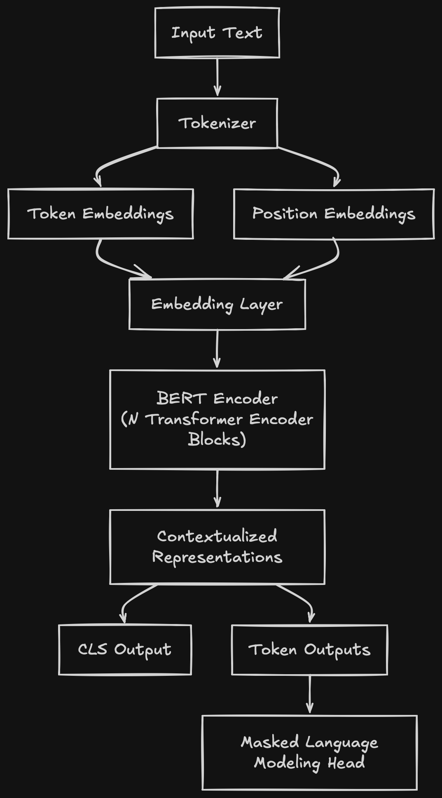

```{python}
#| echo: false
#| eval: true
from pathlib import Path


import jax
import optax
import jax.numpy as jnp
from flax import nnx
import orbax.checkpoint as orbax

from dataclasses import dataclass
import grain.python as pygrain
import polars as pl
import pyarrow as pa

import numpy as np
from tqdm.auto import tqdm

from tokenizers import Tokenizer
from tokenizers.models import WordPiece
from tokenizers.decoders import WordPiece as WordPieceDecoder
from tokenizers.trainers import WordPieceTrainer
from tokenizers.pre_tokenizers import Whitespace
from tokenizers.normalizers import NFD, Lowercase, StripAccents, Sequence
from tokenizers.processors import TemplateProcessing

import matplotlib.pyplot as plt
```

# Overview

In this post, we explore the architecture of BERT, an encoder-only Transformer model. We will walk through its fundamental components and then implement the model from scratch using JAX and Flax, pretraining it on a subset of the C4 dataset.

# Introduction

Bidirectional Encoder Representations from Transformers (BERT) is a Transformer-based model. Transformer architectures utilize self-attention mechanisms to process sequences, allowing the model to weigh the importance of different tokens in a sequence regardless of their distance from one another.

While standard Transformers consist of both an encoder (to process input) and a decoder (to generate output), BERT is an encoder-only model. It processes an input sequence of tokens to produce contextualized vector representations for each token. These representations are then used as features for various downstream tasks, such as text classification or named entity recognition.

Traditionally, BERT is pretrained using two objectives: (1) Masked Language Modeling (MLM) and (2) Next Sentence Prediction (NSP). However, subsequent research has shown that NSP is not strictly necessary for high performance on downstream tasks. In this post, we will focus solely on the MLM objective.

To implement this pretraining pipeline, we will build the following components:

1. <b>A Tokenizer</b>: To convert raw text into integer IDs.

2. <b>A DataLoader</b> To feed data into the model in efficient batches.

3. <b>The Model</b>: A Transformer architecture implemented in JAX/Flax.

4. <b>A Masking Strategy</b>: To implement the MLM objective.

5. <b>A Loss Function</b>: To drive the optimization of the model's weights.

# Tokenization

In a previous [post](/posts/wordpiece_tokenizer/index.qmd), we took a look at the WordPiece algorithm for tokenization and implemented it from scratch in Python and Rust. Today, we will leverage the [Hugging Face Tokenizers](https://github.com/huggingface/tokenizers) library to do this for us. This allows us to focus on the more interesting parts of our pipeline. 

The components of a tokenizer pipeline include:

1. <b>normalizer</b>: A sequence of normalizers applied to the raw text before tokenization.
2. <b>pre-tokenizer</b>: A pre-tokenization step applied to the raw text before the main tokenization process.
3. <b>model</b>: The actual model used for encoding and decoding (e.g., WordPiece).
4. <b>post-processor</b>: A post-processing step applied to the encoded tokens before they are returned.

We define these components within a Hugging Face `tokenizer` and then train it.

```{python}
tokenizer = Tokenizer(WordPiece())

tokenizer.normalizer = Sequence([
    NFD(),
    Lowercase(),
    StripAccents()
])

tokenizer.pre_tokenizer = Whitespace()

trainer = WordPieceTrainer(
    vocab_size=30_000,
    min_frequency=2,
    special_tokens=["[PAD]", "[UNK]", "[CLS]", "[SEP]", "[MASK]"]
)

tokenizer.decoder = WordPieceDecoder(prefix="##")
```

```{python}
# load the training and validation datasets from HF Arrow format
def read_hf_arrow(path):
    with open(path, "rb") as f:
        reader = pa.ipc.open_stream(f)
        table = reader.read_all()
    return pl.from_arrow(table)

train_dir = Path("./c4_train/")
train_files = [str(p.resolve()) for p in train_dir.iterdir() if p.is_file()]
train_df = pl.concat([read_hf_arrow(path) for path in train_files])

val_dir = Path("./c4_val/")
val_files = [str(p.resolve()) for p in val_dir.iterdir() if p.is_file()]
val_df = pl.concat([read_hf_arrow(path) for path in val_files])

```

```{python}
texts = train_df['text'].drop_nulls().to_list()
tokenizer.train_from_iterator(texts, trainer)

tokenizer.post_processor = TemplateProcessing(
    single="[CLS] $A [SEP]",
    pair="[CLS] $A [SEP] $B:1 [SEP]:1",
    special_tokens=[
        ("[CLS]", tokenizer.token_to_id("[CLS]")),
        ("[SEP]", tokenizer.token_to_id("[SEP]")),
    ],
)

def encode_texts_in_batches(texts, tokenizer, batch_size=1000):
    all_inputs = []
    all_attention_masks = []

    # Iterate through the list in chunks of 'batch_size'
    for i in range(0, len(texts), batch_size):
        batch_chunk = texts[i : i + batch_size]
        
        encodings = tokenizer.encode_batch(batch_chunk)
        
        batch_ids = [e.ids for e in encodings]
        batch_masks = [e.attention_mask for e in encodings]
        
        all_inputs.extend(batch_ids)
        all_attention_masks.extend(batch_masks)

    return all_inputs, all_attention_masks

input_ids, attention_masks = encode_texts_in_batches(texts, tokenizer)

val_texts = val_df['text'].drop_nulls().to_list()
val_input_ids, val_attention_masks = encode_texts_in_batches(val_texts, tokenizer)
```

# Data Loader

There are two primary approaches to data loading: tokenizing data on the fly or pre-tokenizing it. While on-the-fly tokenization saves storage, pre-tokenization significantly accelerates training by removing the encoding overhead from the training loop. We will use the pre-tokenized approach here.

We consider two padding strategies: fixed-length and dynamic padding. Fixed padding uses a constant length (usually the maximum sequence length in the dataset), whereas dynamic padding adjusts each batch to its longest sequence. The latter is more computationally efficient because it minimizes redundant computations on padding tokens. To implement this, we use a custom collate function.

When we pre-train the model, we are going to be using a `batch_size` of 128 and a maximum sequence length of 512. The maximum sequence length of a model determines how many tokens the model can process at once, we will talk more about this later. 

```{python}
batch_size = 128
num_epochs = 1 # We will handle epochs manually in the training loop.
maxlen = 512
    
@dataclass
class EncodedDataset:
    """Pre-encoded dataset. Faster but requires more memory."""
    input_ids: list
    attention_masks: list
    maxlen: int

    def __len__(self):
        return len(self.input_ids)

    def __getitem__(self, idx: int):
        inputs = self.input_ids[idx][:self.maxlen] # Truncate
        attention_mask = self.attention_masks[idx][:self.maxlen] # Truncate
        
        return inputs, attention_mask
    
def collate_fn(batch):
    """Dynamic padding data collator"""
    inputs, masks = zip(*batch)
    batch_max_len = np.max([len(l) for l in inputs])
    
    # Dynamic batching
    padded_inputs = [x + [0] * (batch_max_len - len(x)) for x in inputs]
    padded_masks = [x + [0] * (batch_max_len - len(x)) for x in masks]
    
    inputs = np.stack(padded_inputs, axis=0)
    masks = np.stack(padded_masks, axis=0)
    return (inputs, masks) 

def load_and_preprocess_data(input_ids, attention_masks, batch_size, maxlen):

    dataset = EncodedDataset(input_ids, attention_masks, maxlen)

    print(f"Loaded {len(dataset)} samples")

    sampler = pygrain.IndexSampler(
        len(dataset),
        shuffle=False,
        seed=42,
        shard_options=pygrain.NoSharding(),
        num_epochs=num_epochs,
    )

    dl = pygrain.DataLoader(
        data_source=dataset,
        sampler=sampler,
        operations=[pygrain.Batch(batch_size=batch_size, drop_remainder=True, batch_fn=collate_fn)],
    )

    return dl

train_dl = load_and_preprocess_data(input_ids, attention_masks, batch_size, maxlen)
val_dl = load_and_preprocess_data(val_input_ids, val_attention_masks, batch_size, maxlen)

```

# Network Components

The main components of a transformer model are 

1. The self attention mechanism
2. The feed forward network
3. How these get combined into a block and stacked into multiple layers

{#fig-bert-architecture width=40% .lightbox}

We will implement these components in the following sections.

## Multihead Attention

The purpose of self-attention is to allow the model to attend to different parts of the input sequence. When we say "attend to a part of the input sequence", we mean that the model learns which tokens are most relevant for computing the representation of other tokens. An example that highlights the importance of self-attention is disambiguating a polysemous word like "bank." The word "bank" can refer to a financial institution or the side of a river. In order for our model to make accurate predictions about which meaning is intended, it must be able to attend to the surrounding context (e.g., "money" vs. "river"). 

Notice how in the examples below how the word bank attends (bigger value) to different words in the sentence depending on whether it refers to a financial institution or the side of a river.


```{python}
#| eval: true
#| echo: false
#| label: tbl-self-attention
#| tbl-cap: "Self-Attention Examples"
#| tbl-subcap: 
#|   - "River Bank Example"
#|   - "Financial Bank Example"
#| layout-ncol: 2

import pandas as pd
from IPython.display import Markdown, display

tokens_river = ["the", "bank", "of", "the", "river", "was", "steep"]

df_river = pd.DataFrame([
    [0.2, 0.2, 0.1, 0.2, 0.1, 0.1, 0.1],
    [0.0, 0.1, 0.0, 0.1, 0.6, 0.1, 0.1],
    [0.1, 0.3, 0.1, 0.1, 0.1, 0.1, 0.2],
    [0.2, 0.2, 0.1, 0.2, 0.1, 0.1, 0.1],
    [0.1, 0.4, 0.1, 0.1, 0.1, 0.1, 0.1],
    [0.1, 0.1, 0.1, 0.1, 0.2, 0.4, 0.0],
    [0.1, 0.1, 0.1, 0.1, 0.3, 0.1, 0.2],
], columns=tokens_river, index=tokens_river)

river_table_md = df_river.to_markdown()

tokens_fin = ["I", "deposited", "money", "at", "the", "bank"]

df_fin = pd.DataFrame([
    [0.3, 0.2, 0.1, 0.1, 0.1, 0.2],
    [0.1, 0.1, 0.4, 0.1, 0.1, 0.2],
    [0.1, 0.1, 0.2, 0.05, 0.05, 0.5],
    [0.1, 0.1, 0.2, 0.2, 0.2, 0.2],
    [0.1, 0.1, 0.1, 0.1, 0.4, 0.2],
    [0.05, 0.2, 0.4, 0.1, 0.05, 0.2],
], columns=tokens_fin, index=tokens_fin)

display(Markdown(river_table_md))
display(Markdown(df_fin.to_markdown()))

```


Mathematically, self-attention is implemented as a scaled dot-product. The dot-product serves as a measure of similarity between two vectors (Query and Key). We scale this dot product by dividing it by the square root of the dimensionality of the keys ($\sqrt{d_k}$). This scaling is crucial: as the dimensionality increases, the magnitude of the dot products can grow very large, pushing the softmax function into regions with extremely small gradients, which hinders training.

Formally, self-attention can be defined as:

$$
Attention(Q, K, V) = softmax(\frac{QK^T}{\sqrt{d_k}})V
$$

Where:

* $Q$ (Query): A matrix representing the current focus or the element we are looking "at."
* $K$ (Key): A matrix representing all elements in the sequence that the Query is being compared against.
* $V$ (Value): A matrix containing the actual information/content associated with each Key.
* $d_k$: The dimension of the key vectors.

Additionally, self-attention is applied multiple times in parallel through Multi-Head Attention. The input is split into multiple "heads", each of which performs the attention mechanism in a different subspace. This allows the model to simultaneously attend to different types of relationships (e.g., one head focusing on syntactic dependencies while another focuses on semantic content). The outputs from all heads are concatenated and then passed through a final linear projection to return the tensor to the model's original dimensionality.

Note that in our implementation, we omit padding tokens from the computation by passing an `attention_mask`. The mask is used to set the attention scores of padding tokens to $-\infty$ before the softmax operation. This ensures that the model assigns zero probability to these tokens, preventing them from influencing the representation of actual content. Also note that we apply dropout on the attention weights before projecting the output back to the model dimension.

```{python}
class MultiHeadAttention(nnx.Module):
    """Multi-head self-attention module as used in the Transformer / BERT encoder.
    Splits the input into multiple attention heads, computes scaled dot-product
    attention for each head, and then projects the concatenated outputs back
    to the model dimension."""
    def __init__(self, d_model, num_heads, dropout_rate, *, rngs: nnx.Rngs):
        self.num_heads = num_heads
        self.d_model = d_model
        self.head_dim = d_model // num_heads
        self.q_proj = nnx.Linear(d_model, d_model, rngs=rngs)
        self.k_proj = nnx.Linear(d_model, d_model, rngs=rngs)
        self.v_proj = nnx.Linear(d_model, d_model, rngs=rngs)
        self.out_proj = nnx.Linear(d_model, d_model, rngs=rngs)

        self.dropout = nnx.Dropout(rate=dropout_rate, rngs=rngs)

    def __call__(self, x, attention_mask=None):
        batch, seq_len, _ = x.shape

        q = self.q_proj(x).reshape(batch, seq_len, self.num_heads, self.head_dim).transpose(0, 2, 1, 3)
        k = self.k_proj(x).reshape(batch, seq_len, self.num_heads, self.head_dim).transpose(0, 2, 1, 3)
        v = self.v_proj(x).reshape(batch, seq_len, self.num_heads, self.head_dim).transpose(0, 2, 1, 3)

        attn_logits = jnp.matmul(q, k.transpose(0, 1, 3, 2)) / jnp.sqrt(self.head_dim)
        if attention_mask is not None:
            # BERT Mask: mask 0s are padding, mask 1s are real tokens
            attn_logits = jnp.where(attention_mask == 0, -1e9, attn_logits)
        
        attn_weights = jax.nn.softmax(attn_logits, axis=-1)
        attn_weights = self.dropout(attn_weights)
        out = jnp.matmul(attn_weights, v).transpose(0, 2, 1, 3).reshape(batch, seq_len, self.d_model)
        return self.out_proj(out)

```

## Feed Forward Network

The feed forward MLP is quite simple. We have two linear layers with a Gaussian Error Linear Unit (GELU) activation in between. 

Notice that the dropout is applied to the output of the first linear layer. This is a common practice in Transformer models.

```{python}
class FeedForward(nnx.Module):
    """Position-wise feedforward network"""
    def __init__(self, d_model, d_ff, dropout_rate, *, rngs: nnx.Rngs):
        self.linear1 = nnx.Linear(d_model, d_ff, rngs=rngs)
        self.linear2 = nnx.Linear(d_ff, d_model, rngs=rngs)
        self.dropout = nnx.Dropout(rate=dropout_rate, rngs=rngs)

    def __call__(self, x):
        x = self.linear1(x)
        x = jax.nn.gelu(x)
        x = self.dropout(x)
        return self.linear2(x)

```

## Transformer Block

We can now assemble these components into a single, reusable Transformer block. This block follows the architecture described in the original Transformer paper. It begins by applying layer normalization to the input embeddings. Next, we apply multi-head attention, followed by a residual connection that adds the original input back to the attention output. We then apply a second layer of normalization before passing the result through a feedforward network, followed by a final residual connection.

The primary goal of layer normalization is to stabilize the training process. By ensuring that each layer receives inputs with a consistent distribution, we mitigate issues like vanishing or exploding gradients, allowing the model to learn more effectively and converge faster.

```{python}
class TransformerBlock(nnx.Module):
    """Single Transformer block consisting of multi-head self-attention followed by a feedforward network, with residual connections and layer normalization."""
    def __init__(self, d_model, num_heads, d_ff, mha_dropout_rate, ff_dropout_rate, *, rngs: nnx.Rngs):
        self.attention = MultiHeadAttention(d_model, num_heads, mha_dropout_rate, rngs=rngs)
        self.norm1 = nnx.LayerNorm(d_model, rngs=rngs)
        self.ffn = FeedForward(d_model, d_ff, ff_dropout_rate, rngs=rngs)
        self.norm2 = nnx.LayerNorm(d_model, rngs=rngs)

    def __call__(self, x, attention_mask=None):
        x = x + self.attention(self.norm1(x), attention_mask=attention_mask)
        x = x + self.ffn(self.norm2(x))
        return x
```

:::{.callout-note}

We use the Pre-LayerNorm architecture, where normalization is applied before the attention and feed-forward layers, which has been shown to improve training stability in deep transformers. In the original BERT implementation Post-LayerNorm is used instead.

:::

## BERT Encoder

Now we are ready to build the encoder. We initialize token and position embeddings and stack a series of Transformer blocks. First, we pass the token IDs through the embedding layer and add the resulting embeddings to the positional embeddings. The output is then passed through a layer normalization step before entering the Transformer blocks. After the final Transformer block, we apply another layer normalization to produce the sequence output. Finally, we extract the first token ([CLS]), pass it through a linear layer with a tanh activation function, and return it as the pooled output, which can be used for classification tasks.

```{python}
class BERTEncoder(nnx.Module):
    """BERT Encoder consisting of token, and position embeddings followed by a stack of Transformer blocks."""
    def __init__(self, vocab_size, d_model, num_heads, num_layers, d_ff, max_seq_len, mha_dropout_rate=0.1, ff_dropout_rate=0.1, *, rngs: nnx.Rngs):
        # Token and Position Embeddings
        self.token_emb = nnx.Embed(vocab_size, d_model, rngs=rngs)
        self.pos_emb = nnx.Param(jax.random.normal(rngs.params(), (1, max_seq_len, d_model)) * 0.02)
        
        # Encoder Stack
        self.blocks = nnx.List([TransformerBlock(d_model, num_heads, d_ff, mha_dropout_rate, ff_dropout_rate, rngs=rngs) for _ in range(num_layers)])
        self.norm_final = nnx.LayerNorm(d_model, rngs=rngs)
        
        # Linear layer used for classification downstream tasks
        self.pooler_dense = nnx.Linear(d_model, d_model, rngs=rngs)
        self.pooler_act = jax.nn.tanh

        # LayerNorm for input embeddings
        self.embedding_norm = nnx.LayerNorm(d_model, rngs=rngs)

    def __call__(self, input_ids, attention_mask=None):
        # input_ids: (batch, seq_len)
        # mask: (batch, seq_len): 1 for real and 0 for padding
        
        b, s = input_ids.shape
        
        # Combine embeddings: Token + Position
        x = self.token_emb(input_ids)
        x = x + self.pos_emb[:, :s, :]
        x = self.embedding_norm(x)
        
        # Transform the mask for the attention mechanism (this is due to multiple heads)
        # (batch, seq_len) -> (batch, 1, 1, seq_len)
        if attention_mask is not None:
            attn_mask = attention_mask[:, None, None, :]
        else:
            attn_mask = None

        for block in self.blocks:
            x = block(x, attention_mask=attn_mask)
            
        x = self.norm_final(x)
        
        # BERT returns the full sequence of hidden states for NER/QA
        # and a "pooled" output for classification
        sequence_output = x
        
        # Pooled output
        cls_token = x[:, 0, :] 
        pooled_output = self.pooler_act(self.pooler_dense(cls_token))
        
        return sequence_output, pooled_output

```

## Masked Language Modeling

During pre-training, our objective is to predict the masked tokens in our input sequence. To achieve this, we implement an MLM head that processes the normalized sequence output from the BERT encoder. 

The MLM head operates by passing the hidden states through a feed-forward network comprising of linear layers and GELU activation, followed by a dropout layer. To produce the final logits, the output is projected back to the vocabulary size using the weights from the input embedding layer. This technique, known as weight tying, reduces the total parameter count and improves regularization by sharing representations between the input and output layers.


```{python}
class MLMHead(nnx.Module):
    def __init__(self, d_model, vocab_size, embedding_layer, dropout_rate, *, rngs: nnx.Rngs):
        self.linear1 = nnx.Linear(d_model, d_model, rngs=rngs)
        self.linear2 = nnx.Linear(d_model, d_model, rngs=rngs)
        self.dropout = nnx.Dropout(dropout_rate, rngs=rngs)

        # reference to embedding layer for weight tying
        self.embedding = embedding_layer

        # BERT uses a bias term for vocab projection
        self.bias = nnx.Param(jnp.zeros((vocab_size,)))

    def __call__(self, x):
        x = self.linear1(x)
        x = jax.nn.gelu(x)
        x = self.linear2(x)
        x = self.dropout(x)

        # tied weights
        embed_weights = self.embedding.embedding  # (vocab, d_model)

        logits = jnp.matmul(x, embed_weights.T) + self.bias
        return logits

class BertForMaskedLM(nnx.Module):
    def __init__(self, vocab_size, d_model, num_heads, num_layers, d_ff, max_seq_len, mlm_dropout_rate=0.1, *, rngs: nnx.Rngs):

        self.encoder = BERTEncoder(
            vocab_size,
            d_model,
            num_heads,
            num_layers,
            d_ff,
            max_seq_len,
            rngs=rngs
        )

        # pass token embedding for weight tying
        self.mlm_head = MLMHead(
            d_model,
            vocab_size,
            self.encoder.token_emb,
            dropout_rate=mlm_dropout_rate,
            rngs=rngs
        )

    def __call__(self, input_ids, attention_mask=None):
        sequence_output, _ = self.encoder(input_ids, attention_mask)
        logits = self.mlm_head(sequence_output)
        return logits

```

:::{.callout-note}

We add a bias term to the logits as this helps the model learn the baseline frequency of tokens.

:::

To facilitate the MLM task, we apply specific disruptions to the input sequences during training. The algorithm works as follows: first, we select 15% of the tokens in a sequence as candidates for modification. Of these selected tokens, 80% are replaced with a `[MASK]` token, 10% are replaced with a random token from the vocabulary, and the remaining 10% are left unchanged. We then pass the corrupted text through the model and train it to predict the original tokens based on the surrounding context. 

Note that the loss is computed only on the masked tokens, not on the unmasked ones. The figure below depicts these disruptions on the input text (using words rather than token IDs for illustrative purposes).


{#fig-mlm-algorithm width=90% .lightbox}

```{python}
def apply_mlm_masking(
    rng,
    input_ids,
    attention_mask,
    mask_token_id,
    vocab_ids,
    mask_prob=0.15,
):

    rng_select, rng_replace, rng_random = jax.random.split(rng, 3)

    # candidate token selection of mask_prob
    selection_mask = jax.random.bernoulli(
        rng_select,
        p=mask_prob,
        shape=input_ids.shape
    )

    selection_mask = (
        selection_mask &
        attention_mask.astype(bool)
    )

    mlm_loss_mask = selection_mask.astype(jnp.float32)

    # replacement strategy
    replace_probs = jax.random.uniform(
        rng_replace,
        shape=input_ids.shape
    )

    is_mask = replace_probs < 0.80

    is_random = (
        (replace_probs >= 0.80) &
        (replace_probs < 0.90)
    )

    # random token generation
    random_indices = jax.random.randint(
        rng_random,
        shape=input_ids.shape,
        minval=0,
        maxval=len(vocab_ids),
    )

    random_tokens = vocab_ids[random_indices]

    # apply replacements
    masked_input_ids = input_ids

    # 80% is masked
    masked_input_ids = jnp.where(
        selection_mask & is_mask,
        mask_token_id,
        masked_input_ids
    )

    # 10% is replaced with random tokens
    masked_input_ids = jnp.where(
        selection_mask & is_random,
        random_tokens,
        masked_input_ids
    )

    return masked_input_ids, input_ids, mlm_loss_mask
```

### MLM Loss

The loss function for MLM is a cross-entropy loss between the predicted token probabilities and the ground truth token IDs. However, we only want to compute the loss for the masked tokens. We can achieve this by masking out the loss for non-masked tokens.

Mathematically the loss is defined as:
$$\mathcal{L}_{MLM} = \frac{1}{|\mathcal{M}|}\sum_{i \in \mathcal{M}} \log p(y_i | x)$$

Where:

* $\mathcal{M}$ is the set of indices where tokens were masked.
* $|\mathcal{M}|$ is the total number of masked tokens.
* $y_i$ is the ground truth token ID for position $i$.
* $p(y_i \mid x)$ is the predicted probability of the correct token.

```{python}
def mlm_loss_fn(logits, labels, mask):
    """
    logits: (batch, seq_len, vocab_size)
    labels: (batch, seq_len) - the ground truth token IDs
    mask: (batch, seq_len) - 1 for masked tokens, 0 for others
    """
    # Compute the cross-entropy loss for each token
    one_hot_labels = jax.nn.one_hot(labels, logits.shape[-1])
    log_probs = jax.nn.log_softmax(logits, axis=-1)
    loss = -jnp.sum(one_hot_labels * log_probs, axis=-1)
    
    # Apply the mask so we only penalize predictions on masked tokens
    masked_loss = loss * mask
    
    # Average loss over the number of masked tokens
    return jnp.sum(masked_loss) / (jnp.sum(mask) + 1e-8)


def compute_loss(model, input_ids, labels, attention_mask, mask):
    logits = model(input_ids, attention_mask=attention_mask)
    return mlm_loss_fn(logits, labels, mask)

```

# Pretraining

Before we begin training, we must define the architecture of our BERT model and the parameters of our training loop. We specify the model's capacity through dimensions like `d_model` and the number of layers/attention heads, while also setting the computational constraints via `max_seq_len` and `batch_size`. These hyperparameters will dictate both the model's representational power and its memory footprint during training.

```{python}
# Hyperparameters
learning_rate = 1e-3
vocab_size = 30_000
d_model = 256
num_heads = 8
num_layers = 4
d_ff = 1024
max_seq_len = 512
seq_len = 512

batch_size = 128
num_examples = 1_000_000
num_epochs = 5

rngs = nnx.Rngs(0)

# Instantiate Model
model = BertForMaskedLM(vocab_size, d_model, num_heads, num_layers, d_ff, max_seq_len, rngs=rngs)

# Setup Optimizer
optimizer = nnx.Optimizer(model, optax.adamw(learning_rate, weight_decay=1e-2), wrt=nnx.Param)

mask_token_id = tokenizer.token_to_id("[MASK]")

vocab_ids = jnp.array(
    list(tokenizer.get_vocab().values()),
    dtype=jnp.int32
)

grad_fn = nnx.value_and_grad(compute_loss)

@nnx.jit
def train_step(
    model,
    optimizer,
    rng,
    input_ids,
    attention_mask,
    mask_token_id,
    vocab_ids,
):
    rng, mask_rng = jax.random.split(rng)

    masked_input_ids, labels, mlm_loss_mask = apply_mlm_masking(
        mask_rng,
        input_ids,
        attention_mask,
        mask_token_id,
        vocab_ids,
    )

    loss, grads = grad_fn(
        model,
        masked_input_ids,
        labels,
        attention_mask,
        mlm_loss_mask,
    )

    optimizer.update(model, grads)

    return loss, rng


@nnx.jit
def eval_step(
        eval_model,
        input_ids,
        attention_mask,
        mask_token_id,
        vocab_ids
):
    masked_input_ids, labels, mlm_loss_mask = apply_mlm_masking(
        jax.random.PRNGKey(42),
        input_ids,
        attention_mask,
        mask_token_id,
        vocab_ids,
    )

    loss, _ = grad_fn(
        eval_model,
        masked_input_ids,
        labels,
        attention_mask,
        mlm_loss_mask,
    )
    return loss

```


To perform training and evaluation, we create two "views" of our model. The `train_model` view allows for stochastic operations (like dropout) during training, while the `eval_model` view uses a deterministic mode suitable for validation

```{python}
# nnx.view was added in flax 0.12.4
train_model = nnx.view(model, deterministic=False)
eval_model = nnx.view(model, deterministic=True)
```

With the model and optimizer prepared, we begin the training loop. We iterate through the epochs and batches, calculating the loss and updating the model weights using the AdamW optimizer. Periodically, we run a validation pass to monitor the model's performance on unseen data.

```{python}
train_loss_history = []
validation_loss_history = []

for epoch in range(num_epochs):

    total_train_loss = 0.0
    n_train_batches = 0
    train_batch_iter = iter(train_dl) # Initialize the train batch iterator

    for step, batch in tqdm(enumerate(train_batch_iter), total=(num_examples/batch_size)):

        input_ids, attention_mask = batch

        loss, rng = train_step(
            train_model,
            optimizer,
            rng,
            input_ids,
            attention_mask,
            mask_token_id,
            vocab_ids,
        )

        total_train_loss += float(loss)
        n_train_batches += 1

        if step % 1000 == 0:
            if n_train_batches > 0:
                train_loss_history.append(total_train_loss / n_train_batches)

            total_val_loss = 0.0 
            n_validation_batches = 0
            validation_batch_iter = iter(val_dl) # Initialize the validation batch iterator
            
            for val_batch in validation_batch_iter:
                val_input_ids, val_attention_mask = val_batch

                val_loss_val = eval_step(
                        eval_model,
                        val_input_ids,
                        val_attention_mask,
                        mask_token_id,
                        vocab_ids,
                )
                
                total_val_loss += float(val_loss_val)
                n_validation_batches += 1

            if n_validation_batches > 0:
                validation_loss_history.append(total_val_loss / n_validation_batches)

```


```{python}
#| echo: false
#| eval: true

loss = pl.read_csv("./losses.csv")
train_loss_history = loss["train_loss"].to_numpy().tolist()
validation_loss_history = loss["validation_loss"].to_numpy().tolist()
```

The plot below shows the training and validation losses, both of which decrease as training progresses. While we only ran the model for 5 epochs, further training can be used to evaluate long-term performance. On an A100 80GB GPU, each epoch took approximately 40 minutes.

```{python}
#| eval: true
#| fig-cap: "Figure 3: Training and Validation Losses"
#| classes: light-mode
#| fig-dpi: 300

plt.rcParams['figure.dpi'] = 300
plt.figure(figsize=(8, 5))

plt.plot(
    jnp.array(train_loss_history),
    label="Train Loss",
    linewidth=2,
)

plt.plot(
    jnp.array(validation_loss_history),
    label="Validation Loss",
    linewidth=2,
)

plt.xlabel("Evaluation Step")
plt.ylabel("Loss")
plt.title("Training vs Validation Loss")
plt.grid(True, alpha=0.3)
plt.legend(frameon=False)

plt.tight_layout()
plt.show()
```

```{python}
#| eval: true
#| fig-cap: "Figure 3: Training and Validation Losses"
#| classes: dark-mode
#| fig-dpi: 300

plt.style.use("dark_background")
plt.rcParams['figure.dpi'] = 300

plt.figure(figsize=(8, 5))

plt.plot(
    jnp.array(train_loss_history),
    label="Train Loss",
    color="cyan",
    linewidth=2,
)

plt.plot(
    jnp.array(validation_loss_history),
    label="Validation Loss",
    color="orange",
    linewidth=2,
)

plt.xlabel("Evaluation Step")
plt.ylabel("Loss")
plt.title("Training vs Validation Loss")
plt.grid(True, alpha=0.3)
plt.legend(frameon=False)

plt.tight_layout()
plt.show()
```

## Save Checkpoint

The model is saved using `orbax`. Because the training environment was a GPU-enabled Docker container on the cloud, the model was transferred to the CPU prior to serialization.


```{python}
save_directory = Path("./model_checkpoint/bert_jax")
state = nnx.state(model)

checkpointer = orbax.PyTreeCheckpointer()
checkpointer.save(save_directory.absolute(), args=orbax.args.PyTreeSave(state), force=True)

# Move to CPU before saving
save_directory = Path("./model_checkpoint/bert_jax")

state = nnx.state(model)

def to_host(x):
    if isinstance(x, jax.Array):
        # Handle PRNG keys specially
        if jax.dtypes.issubdtype(x.dtype, jax.dtypes.prng_key):
            return np.array(jax.random.key_data(x))
        return np.array(x)
    return x

host_state = jax.tree_util.tree_map(to_host, state)

checkpointer = orbax.PyTreeCheckpointer()

checkpointer.save(
    save_directory.absolute(),
    args=orbax.args.PyTreeSave(host_state),
    force=True,
)
```


# Conclusion

In this blog post, we explored the architectural components of an encoder-only Transformer, specifically BERT. We detailed the inner workings of self-attention, feed-forward networks, and the transformer block. Furthermore, we implemented the MLM task, including the algorithms for generating masks and random token replacements, and analyzed the MLM loss function. Finally, we demonstrated training the model on a dataset of 1 million text examples, verifying that both training and validation losses decreased over time, and showcased how to persist the trained model using Orbax.

Thank you for reading! I hope this deep dive into BERT was helpful, and I look forward to seeing you in the next post as we continue exploring the world of Transformers and Language Models.

# References

::: {#refs}
:::