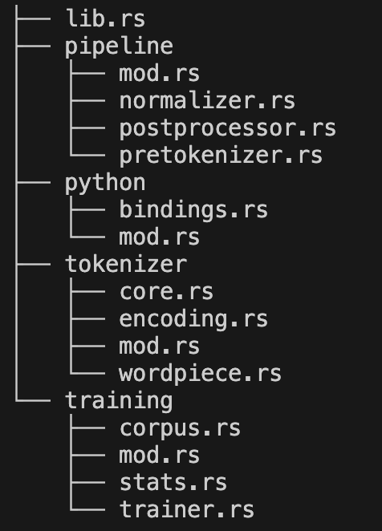

# Overview

This tutorial explores the process of converting raw text into tokens. We will delve into the mechanics of the WordPiece algorithm and demonstrate its implementation from scratch, first in Python and subsequently in Rust as a performance-oriented bonus.


# Introduction

In our previous posts, we simplified tokenization by splitting text into words. However, this approach has limitations when dealing with rare words or out-of-vocabulary (OOV) tokens. To address these issues, we will explore a more sophisticated tokenization technique: WordPiece.

We will examine how the algorithm works and implement it from scratch in Python. As a bonus, we will also implement it in Rust to demonstrate how a lower-level language can provide a more efficient implementation.

# Tokenization

Tokenizing is the process of converting text into a sequence of smaller pieces that are mapped to unique integers (input IDs). Tokenization is a multi-stage pipeline that typically includes:

1. **Normalization**: Standardizing the text (e.g., lowercase normalization, removing accents).
2. **Pre-tokenization**: Splitting the text into initial chunks (e.g., splitting by whitespace or punctuation).
3. **Tokenization**: Applying a subword algorithm (e.g., BPE, WordPiece) to create subword tokens.
4. **Post-processing**: Adding special tokens required by the model architecture (e.g., `[CLS]`, `[SEP]`, or `<|endoftext|>`).

```{mermaid}
graph LR
    Input[Raw Text] --> Norm[1. Normalization]
    Norm --> PreToken[2. Pre-tokenization]
    PreToken --> Token[3. Tokenization]
    Token --> Post[4. Post-processing]
    Post --> Output[Sequence of IDs]

    subgraph "Tokenization Pipeline"
    Norm
    PreToken
    Token
    Post
    end

    style Input fill:#f9f,stroke:#333,stroke-width:2px
    style Output fill:#bbf,stroke:#333,stroke-width:2px
    linkStyle default stroke:#000,stroke-width:2px;
```

Your tokenizing strategy directly impacts your model's robustness and its ability to handle rare or OOV words.

## The WordPiece Algorithm

WordPiece is a tokenization algorithm developed by Google and used in various natural language processing tasks, such as BERT. It works by breaking words down into subwords, which are then represented as tokens. This approach allows for better handling of out-of-vocabulary words, as new words can be represented by combining existing subword tokens.

The algorithm proceeds as follows:
After normalization and pre-tokenization, each token is split into character-level pieces. The first character of a word is kept as is, while subsequent characters are prefixed with `##` (e.g., "token" becomes `t`, `##o`, `##k`, `##e`, `##n`). We then count the frequencies of these individual tokens as well as the frequencies of their co-occurrences. Tokens are scored using the formula:

$$
score_{i, j} = \frac{freq(i, j)}{freq(i) \cdot freq(j)}
$$

The algorithm iteratively merges the pair of tokens with the highest score. This process of counting and merging continues until the predefined vocabulary size is reached.

# WordPiece in Python

Our `Tokenizer` class is responsible for tokenizing text using the `WordPieceEncoder` after the `WordPieceTrainer` has been trained on a given corpus. The tokenizer is initialized with a normalizer and a pre-tokenizer, along with classes for post-processing and encoding. We pass the classes themselves rather than pre-instantiated objects because the post-processing and encoding logic depends on the specific vocabulary generated during training.

The `train` method accepts a corpus and a trainer, which fits a vocabulary to the corpus and subsequently instantiates the post-processor and encoder classes using that vocabulary. We also provide `encode` and `decode` methods. The `encode` method transforms text into a tokenized representation (including IDs and offsets), while the decode method reconstructs the original text from those tokens.

```{python}
import re 

from collections import Counter, defaultdict
from tqdm import tqdm
from urllib import request
```

```{python}
class Tokenizer:
    def __init__(self, normalizer=None, pre_tokenizer=None, post_processor_class=None, encoder_class=None):
        self.token_to_id = {}
        self.id_to_token = {}

        self.normalizer = normalizer
        self.pre_tokenizer = pre_tokenizer

        self.post_processor_class = post_processor_class
        self.encoder_class = encoder_class

        self.post_processor = None
        self.encoder = None

    def train(self, corpus: list[str], trainer):
        # 1. Apply normalization and pre-tokenization
        words = []
        for text in corpus:
            normalized = self.normalizer(text) if self.normalizer else text
            words.extend(self.pre_tokenizer(normalized) if self.pre_tokenizer else [normalized])
        
        # 2. Fit the trainer
        vocab = trainer.train(words)
        
        # 3. Build mappings
        self.token_to_id = {tok: i for i, tok in enumerate(vocab)}
        self.id_to_token = {i: tok for tok, i in self.token_to_id.items()}

        # 4. initialize the encoder and the post processor now that we have the mappings
        if self.encoder_class:
            self.encoder = self.encoder_class(self.token_to_id)
        if self.post_processor_class:
            self.post_processor = self.post_processor_class(self.token_to_id)

    def encode(self, text: str):
        if not self.token_to_id:
            raise ValueError("Tokenizer has not been trained yet.")
        
        normalized = self.normalizer(text)
        pre_tokenized = self.pre_tokenizer(normalized)

        tokens = []
        ids = []
        offsets = []

        i = 0  # global character cursor

        for pt in pre_tokenized:
            start = normalized.find(pt, i)
            end = start + len(pt)

            sub_tokens, sub_ids, sub_offsets = self.encoder(pt)

            # shift offsets into global space
            sub_offsets = [(start + a, start + b) for (a, b) in sub_offsets]

            tokens.extend(sub_tokens)
            ids.extend(sub_ids)
            offsets.extend(sub_offsets)

            i = end

        encoding = {
            "ids": ids,
            "tokens": tokens,
            "offsets": offsets,
        }

        encoding = self.post_processor(encoding)

        return encoding

    def decode(self, ids: list[int], skip_special_tokens: bool = False) -> str:
        if not self.id_to_token:
            return ""

        tokens = [self.id_to_token.get(i, "[UNK]") for i in ids]

        if skip_special_tokens:
            special = {"[PAD]", "[UNK]", "[CLS]", "[SEP]"}
            tokens = [t for t in tokens if t not in special]

        decoded_string = ""
        for i, token in enumerate(tokens):
            if token.startswith("##"):
                # Subword: append directly to the previous token
                decoded_string += token[2:]
            else:
                # New word: add a space if it's not the first token
                if i > 0:
                    decoded_string += " "
                decoded_string += token

        # Remove spaces before punctuation
        decoded_string = re.sub(r"\s+([.,!?;:])", r"\1", decoded_string)
        
        # Remove spaces around apostrophes
        decoded_string = re.sub(r"\s+'\s+", "'", decoded_string)
        
        # Remove spaces around hyphens for compounds
        decoded_string = re.sub(r"\s+-\s+", "-", decoded_string)
        
        # Handle parentheses and brackets
        decoded_string = re.sub(r"\(\s+", "(", decoded_string)
        decoded_string = re.sub(r"\s+\)", ")", decoded_string)
        decoded_string = re.sub(r"\s+\[", "[", decoded_string)
        decoded_string = re.sub(r"\]\s+", "]", decoded_string)
        
        # Standardize extra whitespaces
        decoded_string = decoded_string.strip()

        return decoded_string

```

For simplicity, our normalization pipeline is implemented as a class that performs only lower-case transformation. Similarly, our pre-tokenizer splits the text into words and punctuation marks. We also define a post-processor that adds the special tokens expected by a BERT model, along with an attention mask and a special tokens mask to ensure special tokens are omitted from the loss calculation.


```{python}
class LowercaseNormalizer:
    def __call__(self, text: str) -> str:
        return text.lower()

class BertPreTokenizer:
    def __call__(self, text: str) -> list[str]:
        return re.findall(r"\w+|[^\w\s]", text)

class BertPostProcessor:
    def __init__(self, token_to_id):
        self.token_to_id = token_to_id

    def __call__(self, encoding: dict):
        tokens = encoding["tokens"]
        ids = encoding["ids"]
        offsets = encoding["offsets"]

        # single sequence BERT-style
        tokens = ["[CLS]"] + tokens + ["[SEP]"]
        ids = [self.token_to_id["[CLS]"]] + ids + [self.token_to_id["[SEP]"]]
        offsets = [(0, 0)] + offsets + [(0, 0)]

        special_tokens_mask = [1 if t in ("[CLS]", "[SEP]") else 0 for t in tokens]
        attention_mask = [1] * len(tokens)

        return {
            "tokens": tokens,
            "ids": ids,
            "offsets": offsets,
            "attention_mask": attention_mask,
            "special_tokens_mask": special_tokens_mask,
        }

```

The `WordPieceTrainer` class, implemented below, handles the training process. It accepts a target vocabulary size, a minimum frequency threshold, and an optional list of special tokens. By applying the algorithm described above to a list of pre-tokenized words, the train method produces the final vocabulary.


```{python}
class WordPieceTrainer:
    def __init__(self, vocab_size: int, min_frequency: int = 2, special_tokens=None):
        self.vocab_size = vocab_size
        self.min_frequency = min_frequency
        self.special_tokens = special_tokens or ["[PAD]", "[UNK]", "[CLS]", "[SEP]"]

    def _init_word(self, word: str):
        return [c if i == 0 else f"##{c}" for i, c in enumerate(word)]
    
    def train(self, words: list[str]):
        counts = Counter(words)
        word_freqs = {" ".join(self._init_word(w)): freq for w, freq in counts.items()}
        
        vocab = set(tok for w in word_freqs.keys() for tok in w.split())

        max_merges = self.vocab_size - len(vocab)

        with tqdm(total=max_merges, desc="Training WordPiece") as pbar:
            while len(vocab) < self.vocab_size:
                pair_freqs = defaultdict(int)
                token_freqs = defaultdict(int)

                # Count pairs
                for word, freq in word_freqs.items():
                    tokens = word.split()
                    for i in range(len(tokens)):
                        token_freqs[tokens[i]] += freq
                        if i < len(tokens) - 1:
                            pair_freqs[(tokens[i], tokens[i+1])] += freq

                best_pair = None
                best_score = -1

                # Find best pair
                for (a, b), freq in pair_freqs.items():
                    if freq < self.min_frequency:
                        continue

                    score = freq / (token_freqs[a] * token_freqs[b])

                    if score > best_score:
                        best_score = score
                        best_pair = (a, b)

                if not best_pair:
                    break

                # Merge step
                a, b = best_pair
                target = f"{a} {b}"
                replacement = a + b[2:] if b.startswith("##") else a + b
                
                new_word_freqs = {}
                for word, freq in word_freqs.items():
                    new_word = word.replace(target, replacement)
                    new_word_freqs[new_word] = freq

                word_freqs = new_word_freqs
                vocab.add(replacement)

                pbar.update(1)
                pbar.set_postfix({
                    "vocab": len(vocab),
                    "last_merge": replacement
                })

        if self.special_tokens:
            base_vocab = sorted(vocab)[: self.vocab_size - len(self.special_tokens)]
            vocab = self.special_tokens + base_vocab

        return vocab

```

The `WordPieceEncoder` class utilizes the `token_to_id` mapping generated during the training process. Its `__call__` method accepts a word and returns a tuple containing the subword tokens, their corresponding input IDs, and the character offsets that align each subword to its position in the original word.

```{python}
class WordPieceEncoder:
    def __init__(self, token_to_id):
        self.token_to_id = token_to_id

    def __call__(self, word: str):
        tokens = []
        ids = []
        offsets = []

        i = 0
        while i < len(word):
            match = None
            end = len(word)

            while end > i:
                substr = word[i:end]
                if i > 0:
                    substr = "##" + substr

                if substr in self.token_to_id:
                    match = substr
                    break

                end -= 1

            if match is None:
                unk_id = self.token_to_id["[UNK]"]
                return ["[UNK]"], [unk_id], [(i, len(word))]


            tokens.append(match)
            ids.append(self.token_to_id[match])
            offsets.append((i, end))

            i = end

        return tokens, ids, offsets
```

Below is an example of putting it all together and fitting a tokenizer to a corpus.

```{python}
url = "https://www.gutenberg.org/files/132/132-0.txt" # art of war book
with request.urlopen(url) as response:
    art_of_war = []
    for line in response:
        if line.startswith(b"*** START OF") or line.startswith(b"*** END OF"):
            continue
        art_of_war.append(line.decode('utf-8').strip())
```


```{python}
#| output: false

# Define pipieline steps
norm = LowercaseNormalizer()
pre = BertPreTokenizer()
trainer = WordPieceTrainer(vocab_size=4_000)

# Init Tokenizer
tok = Tokenizer(norm, pre, BertPostProcessor, WordPieceEncoder)

# Train
tok.train(art_of_war, trainer)
```

```{python}
example_string = "Hello World!"
encoding = tok.encode(example_string)
encoding
```

```{python}
tok.decode(encoding["ids"])
```

# Bonus: Rust Implementation

The Python implementation above is excellent for understanding the algorithm, but it would be prohibitively slow for training on large-scale corpora. To address this, we can use PyO3, a library that provides Rust bindings for Python. This allows us to implement the computationally intensive training loop in Rust while maintaining a Python-friendly interface.

To begin, we initialize a new Rust library using `cargo init --lib` and name our package `fast_wordpiece`. We then add `pyo3` as a dependency in our `Cargo.toml`.

We will organize our implementation into a modular structure within the `src` directory:



- `lib.rs`: The crate's entry point. We use this file to declare our modules and define the `PyTokenizer` class that is exported to Python via the `#[pymodule]` macro.

- `pipelines/`: Contains the logic for our normalization, pre-tokenization, and post-processing steps.

- `python/`: Defines the PyO3 bindings, mapping our Rust structures to Python-accessible classes.

- `tokenizer/`: Houses the core tokenizer logic, including structs for encoding outputs and various pre-tokenization strategies.

- `training/`: Implements the high-performance WordPiece training algorithm and its associated data structures.

The files are available for you to explore on the GitHub repository. We will look at how to set up the Python bindings and run it on the same art of war corpus as before.

The bindings are shown below. As we did in Python we import our rust implementation of the normalization, pretokinzation, and post-processing steps from our pipeline module. Our tokenizer struct lives in the tokenizer module and we import that as well. We then define a `PyTokenizer` class that is exported to Python via the `#[pyclass]` macro and we define methods using the `#[pymethods]` macro. We expose the `train`, `encode`, `decode`, and `get_vocab` methods so that they can be called from Python.

```rust
use std::collections::HashMap;
use pyo3::prelude::*;
use pyo3::types::{PyDict, PyList};
use crate::tokenizer::core::Tokenizer;
use crate::pipeline::*;
use crate::training::trainer::train_wordpiece_internal;

#[pyclass]
pub struct PyTokenizer {
    tokenizer: Tokenizer,
}

#[pymethods]
impl PyTokenizer {

    #[staticmethod]
    pub fn train(
        corpus: Bound<'_, PyList>,
        vocab_size: usize,
        min_frequency: u64,
    ) -> Self {

        let mut word_counts: HashMap<String, u32> = HashMap::new();
        let normalizer = LowercaseNormalizer;
        let pretokenizer = BertPreTokenizer;

        for item in corpus.iter() {
            let text: &str = item.extract().unwrap();
            let normalized = normalizer.normalize(text);
            let tokens = pretokenizer.pretokenize(&normalized);

            for token in tokens {
                let count = word_counts.entry(token.text.clone()).or_insert(0);
                *count += 1;
            }
        }

        let (token_to_id, id_to_token, vocab) =
            train_wordpiece_internal(word_counts, vocab_size, min_frequency);

        let tokenizer = Tokenizer {
            token_to_id: token_to_id,
            id_to_token: id_to_token,
            vocab: vocab,
            normalizer: Box::new(LowercaseNormalizer),
            pretokenizer: Box::new(BertPreTokenizer),
            postprocessor: Box::new(BertPostProcessor),
            unk_token: "[UNK]".to_string(),
            cls_token: "[CLS]".to_string(),
            sep_token: "[SEP]".to_string(),
            pad_token: "[PAD]".to_string(),
        };

        Self { tokenizer }
    }

    pub fn encode(&self, py: Python, text: &str) -> PyObject {
        let enc = self.tokenizer.encode(text);

        let dict = PyDict::new(py);

        dict.set_item("ids", &enc.ids).unwrap();
        dict.set_item("tokens", &enc.tokens).unwrap();
        dict.set_item("offsets", &enc.offsets).unwrap();
        
        let attention_mask: Vec<u32> = enc.attention_mask.iter().map(|&x| x as u32).collect();
        let special_tokens_mask: Vec<u32> = enc.special_tokens_mask.iter().map(|&x| x as u32).collect();

        dict.set_item("attention_mask", attention_mask).unwrap();
        dict.set_item("special_tokens_mask", special_tokens_mask).unwrap();

        dict.into()
    }


    pub fn decode(&self, ids: Vec<u32>, skip_special_tokens: bool) -> String {
        self.tokenizer.decode(ids, skip_special_tokens)
    }

    pub fn get_vocab<'py>(&self, py: Python<'py>) -> PyObject {
        let dict = PyDict::new(py);

        for (k, v) in &self.tokenizer.token_to_id {
            dict.set_item(k, v).unwrap();
        }

        dict.into()
    }

}
```

Once we have our Rust implementation ready, we need to compile it into a shared library that can be used by Python. We can do this by using Maturin which is a tool for building and publishing Python packages that use Rust code. The command to build the package is: `maturin develop`. We can now import the `PyTokenizer` class in our Python script and use it as follows:


```{python}
from fast_wordpiece import PyTokenizer
import time

start = time.time()
tok = PyTokenizer.train(art_of_war, 4_000, 2)
end = time.time()
print(f"\nRust training time: {end - start:.4f} seconds")
```


This is significantly faster than our Python implementation! Now let's take a look at how to encode new text using the Rust tokenizer.


```{python}
rust_encoded = tok.encode("Hello world!")
rust_encoded
```

Finally, let's decode our encoded tokens back into text.

```{python}
tok.decode(rust_encoded["ids"], skip_special_tokens=True)
```


With that we have a significantly faster WordPiece tokenizer! Pretty cool!!
2